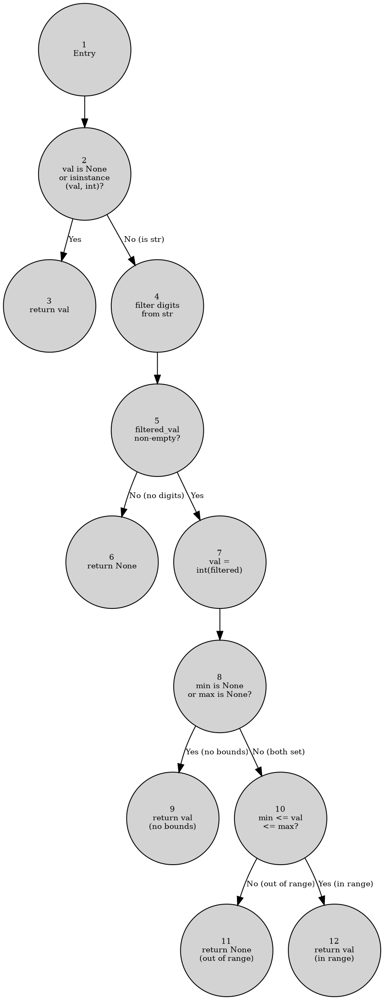
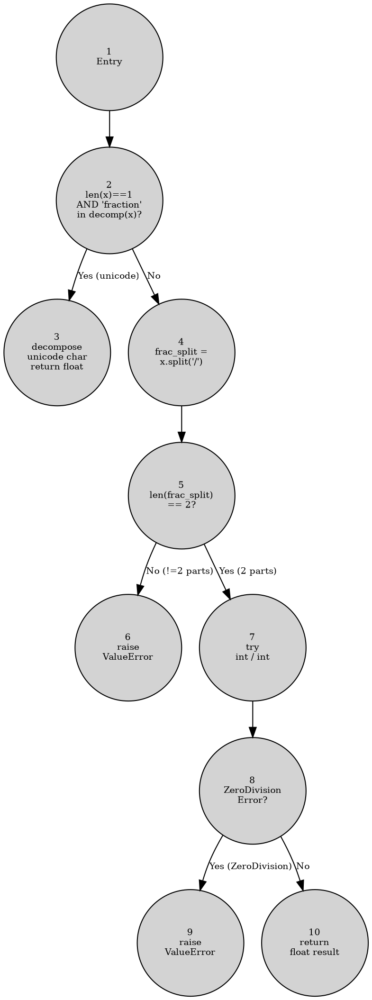
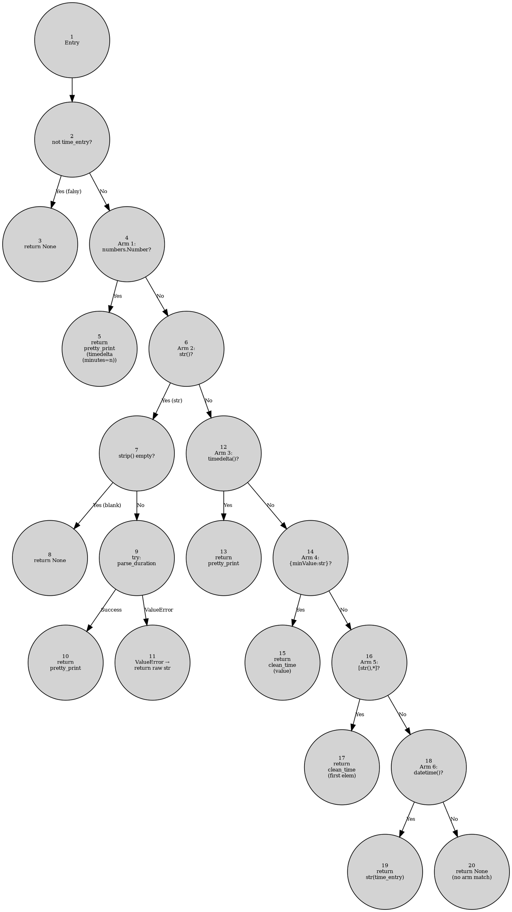
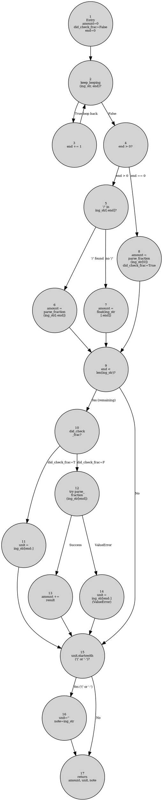
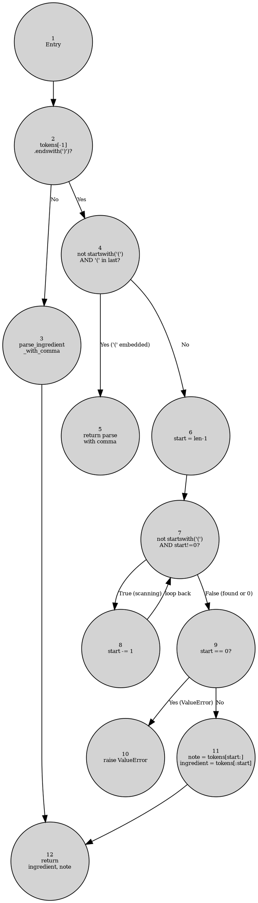
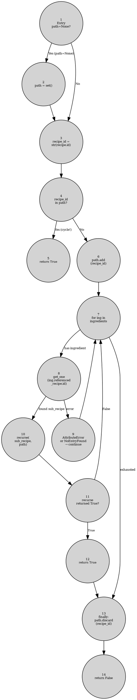
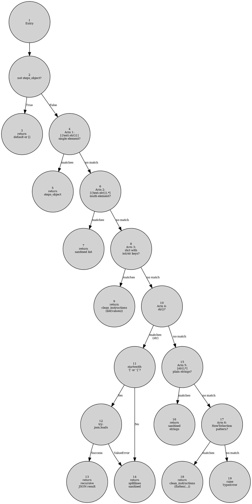

# Software Quality Testing — Final Report

**Project:** Mealie (Recipe Manager FastAPI Application)  
**Test Suite Location:** `tests/our_tests/`  
**Date:** 2026-06-08  
**Authors:** Simona Ristovska, Leona Sanovski

---

## Table of Contents

1. [Project Overview](#1-project-overview)
2. [Functions Analyzed](#2-functions-analyzed)
3. [Criterion 1 — Input Space Partitioning](#3-criterion-1--input-space-partitioning)
4. [Criterion 2 — Graph Coverage](#4-criterion-2--graph-coverage)
5. [Criterion 3 — Logic Coverage](#5-criterion-3--logic-coverage)
6. [Criterion 4 — Parameterized Testing](#6-criterion-4--parameterized-testing)
7. [Criterion 5 — Mock Testing](#7-criterion-5--mock-testing)
8. [Criterion 6 — Mutation Testing](#8-criterion-6--mutation-testing)
9. [Overall Results](#9-overall-results)
10. [Conclusion](#10-conclusion)

---

## 1. Project Overview

Mealie is an open-source, self-hosted recipe manager built with FastAPI (Python). We selected **23 functions** across **8 source files** from the service layer — data cleaning, ingredient parsing, SQL filter building, authentication, shopping list management, recipe lifecycle, and task scheduling.

All functions are pure service-layer logic that require no running web server or database, making them suitable for isolated unit testing.

### Why These Files?

| Source File | Rationale |
|---|---|
| `mealie/services/scraper/cleaner.py` | Rich branch structure, many input types, easy to partition |
| `mealie/services/parser_services/brute/process.py` | Complex graph with loops; DU-path dependencies |
| `mealie/services/query_filter/builder.py` | SQL type guards with LIKE predicate logic |
| `mealie/core/security/security.py` | Security-critical JWT generation |
| `mealie/services/scheduler/tasks/delete_old_checked_shopping_list_items.py` | Pagination + threshold logic |
| `mealie/services/user_services/registration_service.py` | Multi-step registration with token validation |
| `mealie/services/recipe/recipe_service.py` | Permission checks, recursion detection, CRUD |
| `mealie/services/household_services/shopping_lists.py` | Merge logic with compound predicates |

### Six Testing Criteria Applied

| Criterion | Purpose |
|---|---|
| **Input Space Partitioning (ISP)** | Model input domain as characteristics and partitions; derive Base Choice Coverage tests |
| **Graph Coverage** | Build CFG; derive Edge, Edge-Pair, Prime Path, or DU-Path tests |
| **Logic Coverage** | Identify compound predicates; apply RACC / CACC / GACC truth tables |
| **Parameterized Testing** | Express tabular test cases as `@pytest.mark.parametrize` |
| **Mock Testing** | Isolate service-layer logic using `MagicMock` and `patch` |
| **Mutation Testing** | Measure test suite quality by injecting and detecting synthetic bugs |

---

## 2. Functions Analyzed

### 2.1 Criteria Matrix

| Function | File | ISP | Graph | Logic | Param | Mock | Mutmut |
|---|---|:---:|:---:|:---:|:---:|:---:|:---:|
| `clean_int` | cleaner.py | ✓ | CFG | — | ✓ | — | ✓ |
| `clean_string` | cleaner.py | ✓ | CFG | — | ✓ | — | ✓ |
| `parse_fraction` | process.py | ✓ | CFG | — | ✓ | — | ✓ |
| `strip_quotes_from_string` | builder.py | ✓ | CFG | RACC | ✓ | — | ✓ |
| `clean_instructions` | cleaner.py | ✓ | Prime Path | — | ✓ | — | ✓ |
| `clean_time` / `parse_duration` | cleaner.py | ✓ | Prime Path | — | ✓ | — | ✓ |
| `parse_amount` | process.py | ✓ | Prime Path + DU | — | ✓ | — | ✓ |
| `parse_ingredient` | process.py | ✓ | Edge-Pair | — | ✓ | — | ✓ |
| `parse_ingredient_with_comma` | process.py | ✓ | DU-Path | — | ✓ | — | ✓ |
| `can_delete` | recipe_service.py | ✓ | CFG | RACC | — | ✓ | ✓ |
| `can_merge` | shopping_lists.py | ✓ | CFG | RACC + CACC + GACC | — | ✓ | ✓ |
| `clean_yield` | cleaner.py | ✓ | CFG | RACC | ✓ | — | ✓ |
| `validate` | builder.py | — | CFG | GACC | ✓ | — | ✓ |
| `bulk_create_items` | shopping_lists.py | ✓ | CFG | — | — | ✓ | ✓ |
| `create_access_token` | security.py | ✓ | CFG | — | ✓ | ✓ | ✓ |
| `create_one` | recipe_service.py | ✓ | CFG | CACC | — | ✓ | ✓ |
| `_trim_list_items` | delete_old_checked.py | ✓ | CFG | — | — | ✓ | ✓ |
| `delete_old_checked_list_items` | delete_old_checked.py | ✓ | CFG | — | — | ✓ | ✓ |
| `get_one` | recipe_service.py | ✓ | CFG | — | — | ✓ | ✓ |
| `has_recursive_recipe_link` | recipe_service.py | ✓ | Prime Path | — | ✓ | ✓ | ✓ |
| `merge_items` | shopping_lists.py | ✓ | CFG | RACC | — | ✓ | ✓ |
| `_pre_update_check` | recipe_service.py | — | CFG | CACC | — | ✓ | ✓ |
| `register_user` | registration_service.py | ✓ | CFG | — | — | ✓ | ✓ |
| `remove_recipe_ingredients_from_list` | shopping_lists.py | ✓ | CFG | — | — | ✓ | ✓ |

### 2.2 Test File Summary

| Test File | Classes | Tests |
|---|---|:---:|
| `test_cleaner.py` | `CleanIntTests`, `CleanStringTests`, `ParseFractionTests`, `CleanInstructionsTests`, `CleanTimeTests`, `CleanYieldTests` | 54 |
| `test_brute_parser.py` | `ParseFractionTests`, `ParseAmountTests`, `ParseIngredientTests`, `ParseIngredientWithCommaTests` | 25 |
| `test_query_filter.py` | `StripQuotesTests`, `ValidateTests`, `QueryFilterBuilderTests` | 23 |
| `test_recipe_service.py` | `CanDeleteTests`, `GetOneTests`, `CreateOneTests`, `HasRecursiveRecipeLinkTests`, `PreUpdateCheckTests` | 37 |
| `test_shopping_list.py` | `CanMergeTests`, `BulkCreateItemsTests`, `MergeItemsTests`, `RemoveRecipeIngredientsTests` | 32 |
| `test_auth.py` | `CreateAccessTokenTests`, `RegisterUserTests` | 22 |
| `test_scheduler.py` | `TrimListItemsTests`, `DeleteOldCheckedListItemsTests` | 10 |
| **TOTAL** | **24 classes** | **203** |

**Why we grouped tests into classes:** Each class corresponds to one function under test (e.g. `CanDeleteTests` contains all tests for `can_delete`). This makes it immediately clear which function a failing test belongs to, allows shared setup code (`setup_method`) to be written once instead of repeated in every test, and keeps the 203 tests navigable across 7 files. pytest collects these classes automatically because `pyproject.toml` sets `python_classes = '*Tests'` — every class whose name ends in `Tests` is picked up as a test container.

---

## 3. Criterion 1 — Input Space Partitioning

### 3.1 Methodology

ISP models the input domain as a set of **characteristics** — independent properties of the inputs that influence behaviour. Each characteristic is divided into mutually exclusive, collectively exhaustive **partitions**. We applied **Base Choice Coverage (BCC)**: one partition per characteristic is designated the base (most typical), and one test is generated per non-base partition while holding others at base.

### 3.2 Worked Example A — `clean_int()`

**File:** `mealie/services/scraper/cleaner.py`  
**Signature:** `clean_int(val: str | int | None, min=None, max=None) -> int | None`

Extracts the first integer from a string, or passes through `int`/`None`. Optionally enforces inclusive `[min, max]` bounds.

#### Control Flow Graph



> Render by pasting the DOT block into **dreampuf.github.io/GraphvizOnline**

#### Node Table

| Node | Description |
|------|-------------|
| 1 | Entry — receive `val`, `min`, `max` |
| 2 | `val is None or isinstance(val, int)` — pass-through check |
| 3 | `return val` as-is *(terminal)* |
| 4 | Filter string to digits only |
| 5 | `bool(filtered_val)` — any digits found? |
| 6 | `return None` (no digits) *(terminal)* |
| 7 | `val = int(filtered_val)` |
| 8 | `min is None or max is None` — bounds active? |
| 9 | `return val` (no bounds check) *(terminal)* |
| 10 | `min <= val <= max` — in-range check |
| 11 | `return None` (out of range) *(terminal)* |
| 12 | `return val` (in range) *(terminal)* |

#### Characteristics and Partitions

| ID | Characteristic | Partitions |
|----|----------------|------------|
| C1 | Type/value of `val` | A: `None` · B: `int` · C: str with digits only · D: str mixed (letters + digits) · E: str with no digits |
| C2 | Bounds specification | A: both `None` (no bounds) · B: both provided · C: only `min` provided · D: only `max` provided |
| C3 | Range position *(active only when C2=B)* | A: `val == min` · B: `val == max` · C: interior · D: below `min` · E: above `max` |

**Constraints:** C1 ∈ {A,B} bypasses nodes 4–12 entirely; C3 only applies when C2=B.

#### Base Choice Coverage Test Cases

| Test | C1 | C2 | C3 | Input `val` | `min` | `max` | Expected | Path |
|------|----|----|-----|-------------|-------|-------|----------|------|
| T1 | A | — | — | `None` | — | — | `None` | 1→2→3 |
| T2 | B | — | — | `5` | — | — | `5` | 1→2→3 |
| T3 | B | — | — | `0` | — | — | `0` | 1→2→3 |
| **T4 (base)** | C | A | — | `"42"` | `None` | `None` | `42` | 1→2→4→5→7→8→9 |
| T5 | D | A | — | `"abc5def"` | `None` | `None` | `5` | 1→2→4→5→7→8→9 |
| T6 | E | A | — | `"abc"` | `None` | `None` | `None` | 1→2→4→5→6 |
| T7 | C | B | C | `"5"` | `1` | `10` | `5` | 1→…→10→12 |
| T8 | C | B | A | `"1"` | `1` | `10` | `1` | 1→…→10→12 (at min) |
| T9 | C | B | B | `"10"` | `1` | `10` | `10` | 1→…→10→12 (at max) |
| T10 | C | B | D | `"0"` | `1` | `10` | `None` | 1→…→10→11 |
| T11 | C | B | E | `"15"` | `1` | `10` | `None` | 1→…→10→11 |
| T12 | C | C | — | `"5"` | `1` | `None` | `5` | 1→…→8→9 |
| T13 | C | D | — | `"5"` | `None` | `10` | `5` | 1→…→8→9 |

### 3.3 Worked Example B — `parse_fraction()`

**File:** `mealie/services/parser_services/brute/process.py`  
**Signature:** `parse_fraction(x) -> float`

Parses a fraction string. Supports Unicode fraction characters (`½`, `⅓`, `¾`) and `"N/D"` string format. Raises `ValueError` for all invalid inputs.

#### CFG



#### Characteristics and Test Cases

| ID | Characteristic | Partitions |
|----|----------------|------------|
| C1 | Input structure | A: single Unicode fraction char · B: valid "N/D" string · C: "N/0" (zero denominator) · D: no "/" and len > 1 · E: multiple "/" · F: single non-fraction char |

| Test | C1 | Input | Expected | Path |
|------|----|-------|----------|------|
| T1 | A | `"½"` | `0.5` | 1→2→3 |
| T2 | A | `"⅓"` | `≈0.333` | 1→2→3 |
| T3 | A | `"¾"` | `0.75` | 1→2→3 |
| T4 | B | `"1/2"` | `0.5` | 1→2→4→5→7→8→10 |
| T5 | B | `"3/4"` | `0.75` | 1→2→4→5→7→8→10 |
| T6 | C | `"1/0"` | `ValueError` | 1→2→4→5→7→8→9 |
| T7 | D | `"abc"` | `ValueError` | 1→2→4→5→6 |
| T8 | E | `"1/2/3"` | `ValueError` | 1→2→4→5→6 |
| T9 | F | `"a"` | `ValueError` | 1→2→4→5→6 |

### 3.4 Worked Example C — `strip_quotes_from_string()`

**File:** `mealie/services/query_filter/builder.py`  
**Signature:** `strip_quotes_from_string(val: str) -> str`

Returns `val[1:-1]` if `val` is longer than 2 characters and enclosed in double-quotes. This function also appears in the Logic Coverage section (RACC on its 3-clause conjunction guard).

#### Characteristics and Test Cases

| ID | Characteristic | Partitions |
|----|----------------|------------|
| C1 | Length of `val` | A: len=0 · B: len=1 · C: len=2 (boundary) · D: len>2 |
| C2 | Quote structure *(only when C1=D)* | A: both quotes · B: opening only · C: closing only · D: no quotes |

| Test | C1 | C2 | Input | Expected |
|------|----|----|-------|----------|
| T1 | A | — | `""` | `""` |
| T2 | B | — | `'"'` | `'"'` |
| T3 | C | — | `'""'` | `'""'` (boundary: len=2 not > 2) |
| **T4 (base)** | D | A | `'"hello"'` | `'hello'` |
| T5 | D | B | `'"hello'` | `'"hello'` |
| T6 | D | C | `'hello"'` | `'hello"'` |
| T7 | D | D | `'hello'` | `'hello'` |
| T8 | D | A | `'"x"'` | `'x'` (minimal valid strip, len=3) |

### 3.5 Worked Example D — `register_user()`

**File:** `mealie/services/user_services/registration_service.py`

ISP is particularly powerful for routing functions where behaviour depends entirely on which combination of inputs and repository states are active.

#### Characteristics

| ID | Characteristic | Partitions |
|----|----------------|------------|
| C1 | Username collision | A: username taken · B: free |
| C2 | Email collision | A: email taken · B: free |
| C3 | Group routing | A: `group_token` provided · B: `group` flag (new group) · C: neither |
| C4 | Token validity *(when C3=A)* | A: not found · B: group missing · C: household missing · D: all valid |
| C5 | Seed data *(when C3=B)* | A: `True` · B: `False` |
| C6 | Token use count *(when C3=A, C4=D)* | A: `uses_left > 1` → update · B: `uses_left == 1` → delete |

#### Test Case Table

| Test | C1 | C2 | C3 | C4 | C5 | C6 | Expected |
|----|----|----|----|----|----|----|---------|
| T1 | A | — | — | — | — | — | `HTTP 409` (username conflict) |
| T2 | B | A | — | — | — | — | `HTTP 409` (email conflict) |
| T3 | B | B | C | — | — | — | `HTTP 400` (no group) |
| T4 | B | B | A | A | — | — | `HTTP 400` (token not found) |
| T5 | B | B | A | B | — | — | `HTTP 400` (group missing) |
| T6 | B | B | A | C | — | — | `HTTP 400` (household missing) |
| T7 | B | B | A | D | — | A | `PrivateUser`; token updated |
| T8 | B | B | A | D | — | B | `PrivateUser`; token deleted |
| T9 | B | B | B | — | A | — | `PrivateUser`; seeder called |
| T10 | B | B | B | — | B | — | `PrivateUser`; seeder NOT called |

---

## 4. Criterion 2 — Graph Coverage

### 4.1 Methodology

For functions with complex branches, loops, or recursion we build a Control Flow Graph (CFG) and derive tests using one of four coverage levels:

| Level | Requirement | When Used |
|---|---|---|
| **Edge Coverage** | Every edge traversed at least once | Simple branches, short functions |
| **Edge-Pair Coverage** | Every consecutive pair of edges traversed | Two-level branching interactions |
| **Prime Path Coverage** | Every maximal simple path traversed | Loops, long match statements |
| **DU-Path Coverage** | Every definition-use pair for each variable | Data-flow dependencies across branches |

### 4.2 Worked Example A — `clean_time()` (Prime Paths)

**File:** `mealie/services/scraper/cleaner.py`

A `match` statement over 8 structural forms of scraped `recipeTime` data. All arms are exclusive, so every simple path from entry to a terminal is a prime path.

#### CFG



#### Prime Paths and Test Cases

| PP | Path | Test Input | Expected |
|----|------|-----------|----------|
| PP1 | 1,2,3 | `None` or `0` | `None` |
| PP2 | 1,2,4,5 | `30` (int) | `"30 minutes"` |
| PP3 | 1,2,4,6,7,8 | `"   "` (blank string) | `None` |
| PP4 | 1,2,4,6,7,9,10 | `"PT1H30M"` (ISO) | `"1 hour 30 minutes"` |
| PP5 | 1,2,4,6,7,9,11 | `"1 hour 30 mins"` (invalid ISO) | `"1 hour 30 mins"` (raw) |
| PP6 | 1,2,4,6,12,13 | `timedelta(hours=2)` | `"2 hours"` |
| PP7 | 1,2,4,6,12,14,15 | `{"minValue": "PT30M"}` | `"30 minutes"` (recursive) |
| PP8 | 1,2,4,6,12,14,16,17 | `["PT1H"]` | `"1 hour"` (recursive) |
| PP9 | 1,2,4,6,12,14,16,18,19 | `datetime(2024,1,1)` | `"2024-01-01 00:00:00"` |
| PP10 | 1,2,4,6,12,14,16,18,20 | `b"bytes"` | `None` (no arm matched) |

**10 prime paths → 10 test cases.** Without graph coverage analysis, the HowToSection arm (PP8), the minValue dict arm (PP7), and the invalid-ISO raw-return path (PP5) could all be missed.

### 4.3 Worked Example B — `parse_amount()` (Prime Paths + DU-Paths)

**File:** `mealie/services/parser_services/brute/process.py`

Scans the leading characters of an ingredient string to extract a numeric amount. Contains a `while` loop and a `did_check_frac` boolean flag — both requiring graph and data-flow analysis.

#### CFG (Key Nodes)



#### Prime Path Test Cases

| PP | Path | Input | Expected `(amount, unit, note)` |
|----|------|-------|--------------------------------|
| PP1 | 1->2->4->8->9->15->17 | `"½"` | `(0.5, "", "")` |
| PP2 | 1->2->4->8->9->10->11->15->17 | `"½cups"` | `(0.5, "cups", "")` |
| PP3 | 1->2->4->8->9->15->16->17 | `"½(500ml)"` | `(0.5, "", "½(500ml)")` |
| PP4 | 1->2->3->2->4->5->6->9->15->17 | `"1/2"` | `(0.5, "", "")` |
| PP5 | 1->2->3->2->4->5->6->9->10->12->14->15->17 | `"1/2cups"` | `(0.5, "cups", "")` |
| PP6 | 1->2->3->2->4->5->7->9->15->17 | `"42"` | `(42.0, "", "")` |
| PP7 | 1->2->3->2->4->5->7->9->10->12->13->15->17 | `"2½cups"` | `(2.5, "cups", "")` |
| PP8 | 1->2->3->2->4->5->7->9->10->12->14->15->17 | `"2cups"` | `(2.0, "cups", "")` |
| PP9 | 1->2->3->2->4->5->7->9->10->12->14->15->16->17 | `"2-3"` | `(2.0, "", "2-3")` |

#### DU-Path Analysis — `did_check_frac`

| Definition | Node | Value |
|---|---|---|
| D-init | 1 | `False` |
| D-set | 8 | `True` (unicode char path only) |

| DU-Path | Def → Use | Effect |
|---|---|---|
| `D-init=False → U-branch(node 10)` | 1 → 10 | Routes to node 12 (attempt fraction parse) |
| `D-set=True → U-branch(node 10)` | 8 → 10 | Routes to node 11 (unit is everything after unicode char) |

The path `D-set=True → U-aug(node 13)` is **infeasible**: node 8 sets `did_check_frac=True`, forcing node 10 → node 11, so node 12 (the augmented-amount site) is never reached. Documented but not tested.

### 4.4 Worked Example C — `parse_ingredient()` (Edge-Pair Coverage)

**File:** `mealie/services/parser_services/brute/process.py`

Splits an ingredient token list into `(ingredient, note)`. Performs a backward scan to find the opening bracket matching the last token's closing bracket.

#### CFG



#### Edge-Pair Test Requirements

| Edge Pair | Test Input | Covers |
|-----------|-----------|--------|
| `(1→2, 2→3)` | `["salt"]` | No closing bracket → delegate |
| `(1→2, 2→4)` | `["sugar (1 cup)"]` | Has closing bracket |
| `(2→4, 4→5)` | `["salt (fine)"]` | `(` embedded mid-token |
| `(2→4, 4→6)` | `["1", "cup", "(flour)"]` | Separate bracket token |
| `(7→8, 8→7)` | `["1", "cup", "flour", "(sifted)"]` | Multi-token scan |
| `(7→9, 9→11)` | `["1", "(cup flour)"]` | Finds `(` at index 1 |
| `(7→9, 9→10)` | `["(entire input)"]` | `(` only at index 0 → ValueError |

### 4.5 Worked Example D — `has_recursive_recipe_link()` (Prime Paths over Recursion)

**File:** `mealie/services/recipe/recipe_service.py`

DFS cycle detection over recipe-to-ingredient-to-sub-recipe links. Prime paths are enumerated as call-depth scenarios.

#### CFG (Single Frame)



#### Prime Path Test Cases (as call scenarios)

| PP | Scenario | Test Input | Expected |
|----|----------|-----------|---------|
| PP1 | No ingredients | Recipe with empty ingredient list | `False` |
| PP2 | Ingredient, no sub-recipe (AttributeError) | Ingredient with no `referenced_recipe` | `False` |
| PP3 | Ingredient, sub-recipe found, no cycle | A → B (B has no further links) | `False` |
| PP4 | Two ingredients: first errors, second clean | A has 2 ings; ing1 errors; ing2 → B | `False` |
| PP5 | Direct self-link (depth 1 cycle) | A → A | `True` |
| PP6 | Indirect cycle (depth 2) | A → B → A | `True` |
| PP7 | Clean 3-level chain | A → B → C → (no links) | `False` |
| PP8 | `path=None` vs explicit empty set | Both start states | Same result |

**Backtracking verification:** After a clean call, `len(path) == 0` is asserted to confirm the `finally: path.discard(recipe_id)` block correctly restores the path set.

### 4.6 Worked Example E — `clean_instructions()` (Prime Paths)

**File:** `mealie/services/scraper/cleaner.py`

Handles 7 structural forms of `recipeInstructions` data from scraped websites via structural pattern matching. Three arms call `clean_instructions` recursively.

#### CFG



#### Key Node Table

| Node | Description | Terminal? |
|------|-------------|-----------|
| 1 | Entry | — |
| 2 | `not steps_object` guard | — |
| 3 | `return default or []` | T1 |
| 4 | Arm 1: `[{"text": str()}]` single element | — |
| 5 | `return steps_object` unchanged | T2 |
| 6 | Arm 2: `[{"text": str()}, *_]` multi-element | — |
| 7 | `return` sanitised list | T3 |
| 8 | Arm 3: dict with integer/string keys | — |
| 9 | `return clean_instructions(list(values))` recursive | T4 |
| 10 | Arm 4: `str()` — entire input is string | — |
| 11 | `startswith("[")` or `startswith("{")` check | — |
| 12 | `try: json.loads(step_as_str)` | — |
| 13 | `return` recursive result from JSON | T5 |
| 14 | `return` splitlines, each sanitised | T6 |
| 15 | Arm 5: `[str(), *_]` list of plain strings | — |
| 16 | `return` sanitised plain strings | T7 |
| 17 | Arm 6: HowToSection pattern | — |
| 18 | `return clean_instructions(flatten(...))` recursive | T8 |
| 19 | `raise TypeError` — no arm matched | T9 |

#### Prime Path Test Cases

| PP | Path | Test Input | Expected |
|----|------|-----------|----------|
| PP1 | 1->2->3 | `None` | `[]` |
| PP2 | 1->2->4->5 | `[{"text": "Boil water"}]` | `[{"text": "Boil water"}]` |
| PP3 | 1->2->4->6->7 | `[{"text": "Boil"}, {"text": "Add salt"}]` | sanitised list |
| PP4 | 1->2->4->6->8->9 | `{"0": "First step", "1": "Second step"}` | `[{"text": "First step"}, ...]` |
| PP5 | 1->2->4->6->8->10->11->12->13 | `'[{"text": "Step 1"}]'` (JSON string) | `[{"text": "Step 1"}]` |
| PP6 | 1->2->4->6->8->10->11->14 | `"Boil water\nAdd salt"` (plain string) | `[{"text": "Boil water"}, ...]` |
| PP7 | 1->2->4->6->8->10->11->12->14 | `'[invalid json'` | splitlines result |
| PP8 | 1->2->4->6->8->10->15->16 | `["Step A", "Step B"]` | sanitised string list |
| PP9 | 1->2->4->6->8->10->15->17->18 | `[{"@type": "HowToSection", ...}]` | flattened recursive |
| PP10 | 1->2->4->6->8->10->15->17->19 | `[42, 99]` | `TypeError` |

---

## 5. Criterion 3 — Logic Coverage

### 5.1 Methodology

For functions containing **compound boolean predicates** we apply one or more of:

- **RACC** (Restricted Active Clause Coverage): for each clause `Ci`, hold all other clauses at a fixed value so that `Ci` alone determines the predicate outcome. One test with `Ci=T, P=T`; one with `Ci=F, P=F`.
- **CACC** (Correlated Active Clause Coverage): for each clause `Ci`, produce a `P=T` test and a `P=F` test where `Ci` is the active (determining) clause; other clauses may vary.
- **GACC** (General Active Clause Coverage): each clause is the active clause in at least one `P=T` and one `P=F` test; no restriction on other clauses across rows.

### 5.2 Worked Example A — `RecipeService.can_delete()` (RACC)

**File:** `mealie/services/recipe/recipe_service.py`

```python
def can_delete(self, recipe: Recipe) -> bool
```

A user can delete a recipe if they are an **admin** OR they own **all** of the recipe's timeline plan entries.

**Predicate:** `P = C1 ∨ C2`

- `C1` = `self.is_admin`
- `C2` = `all(self.user.id == entry.recipe_id for entry in recipe.recipe_timeline_events)`

#### RACC Truth Table

| Row | C1 (is_admin) | C2 (all_owned) | P (C1 ∨ C2) | Active Clause |
|-----|:---:|:---:|:---:|---|
| TR1 | **T** | F | **T** | C1 determines P (C2=F so C1 is the deciding factor) |
| TR2 | **F** | F | **F** | C1 determines P |
| TR3 | F | **T** | **T** | C2 determines P (C1=F so C2 is the deciding factor) |
| TR4 | F | **F** | **F** | C2 determines P |

All four rows feasible: TR1 = admin with 0 owned plans; TR2 = non-admin with 0 owned; TR3 = non-admin owning all plans; TR4 = non-admin owning partial plans.

#### Test Cases

| Test | C1 | C2 | Expected | Verified By |
|------|:---:|:---:|----------|---|
| T1 | T | F | `True` | TR1 |
| T2 | F | F | `False` | TR2 |
| T3 | F | T | `True` | TR3 |
| T4 | F | F | `False` | TR4 (partially owned plans) |
| T5 | T | T | `True` | bonus: both clauses true |

### 5.3 Worked Example B — `ShoppingListService.can_merge()` (RACC + CACC + GACC)

**File:** `mealie/services/household_services/shopping_lists.py`

```python
def can_merge(self, item1: ShoppingListItemBase, item2: ShoppingListItemBase) -> bool
```

Two items can be merged if: both unchecked, same food, and compatible units.

**Two compound predicates:**

```
P1 = any([C1, C2, C3])  =  C1 ∨ C2 ∨ C3
   C1 = item1.checked
   C2 = item2.checked
   C3 = item1.food_id != item2.food_id
   [P1=True means "cannot merge" → return False]

P3 = C4 ∨ C5
   C4 = bool(item1.food_id)
   C5 = item1.note == item2.note
```

#### P1 — RACC Truth Table (3-clause disjunction)

| Row | C1 | C2 | C3 | P1 | Active Clause |
|-----|:---:|:---:|:---:|:---:|---|
| TR1 | **T** | F | F | **T** | C1 (C2=F,C3=F) |
| TR2 | **F** | F | F | **F** | C1 |
| TR3 | F | **T** | F | **T** | C2 (C1=F,C3=F) |
| TR4 | F | **F** | F | **F** | C2 |
| TR5 | F | F | **T** | **T** | C3 (C1=F,C2=F) |
| TR6 | F | F | **F** | **F** | C3 |

#### P3 — RACC Truth Table (2-clause disjunction)

| Row | C4 (food_id set) | C5 (notes equal) | P3 | Active Clause |
|-----|:---:|:---:|:---:|---|
| TR7 | **T** | F | **T** | C4 (C5=F so C4 decides) |
| TR8 | **F** | F | **F** | C4 |
| TR9 | F | **T** | **T** | C5 (C4=F so C5 decides) |
| TR10 | F | **F** | **F** | C5 |

All 10 rows are feasible with concrete item fixtures.

### 5.4 Worked Example C — `RecipeService._pre_update_check()` (CACC)

**File:** `mealie/services/recipe/recipe_service.py`

Four sequential guard predicates. CACC (not RACC) is used because the clauses within each predicate are not held at a fixed complement — tests may reuse clause values across predicates.

| Predicate | Expression | Raises |
|---|---|---|
| P1 | `not is_owner AND not is_admin` | `PermissionError` |
| P2 | `not can_lock_unlock AND locked` | `PermissionError` |
| P3 | `recipe_lock_plan_days AND not can_lock_unlock` | `PermissionError` |
| P4 | `not can_lock_unlock AND lock_plan` | `PermissionError` |

#### P2 CACC Table (representative)

| Test | `can_lock_unlock` | `locked` | P2 result | Expected |
|------|:---:|:---:|:---:|---|
| T1 | F | **T** | **True** | raises `PermissionError` |
| T2 | F | **F** | False | no error |
| T3 | **T** | T | False | no error |
| T4 | **T** | F | False | no error |

All four predicates yield 8 total test cases across `PreUpdateCheckTests`.

### 5.5 Worked Example D — `clean_yield()` (RACC on a Conjunction)

**File:** `mealie/services/scraper/cleaner.py`

**Predicate P** at node 11 (decides servings vs raw yield):

```
P = A ∧ B
  A = bool(qty)               — quantity is non-zero after parsing
  B = _is_serving_string(yld) — yield string contains a servings keyword
```

#### RACC Truth Table

| Row | A (qty truthy) | B (is_serving_string) | P | Active Clause | Input | Expected |
|-----|:---:|:---:|:---:|---|---|---|
| TR1 | **T** | **T** | **T** | — | `"4 servings"` | `servings_qty=4` |
| TR2 | **F** | T | **F** | **A** active | `"servings"` (no number) | `yld_qty=0` |
| TR3 | T | **F** | **F** | **B** active | `"4 pies"` | `yld_qty=4` |

Without TR2, a test suite could pass even if `_is_serving_string` always returned `True`. Without TR3, a test suite could pass even if `qty` was never checked.

### 5.6 Worked Example E — `QueryFilterBuilderComponent.validate()` (GACC)

**File:** `mealie/services/query_filter/builder.py`

**Predicate P_LIKE** (node 6):

```
P_LIKE = rel is LIKE ∨ rel is NOT_LIKE
```

#### GACC Truth Table

| Row | `rel is LIKE` | `rel is NOT_LIKE` | P_LIKE | Active Clause |
|-----|:---:|:---:|:---:|---|
| TR1 | **T** | F | **T** | `LIKE` is active |
| TR2 | **F** | F | **F** | `LIKE` is active false |
| TR3 | F | **T** | **T** | `NOT_LIKE` is active |
| TR4 | F | **F** | **F** | `NOT_LIKE` is active false |

GACC (not RACC) is used here because the two clauses are operationally symmetric — using `rel is LIKE` as the active clause while holding `rel is NOT_LIKE` constant (and vice versa) naturally satisfies the active-clause requirement without additional constraint.

### 5.7 Logic Coverage Summary

| Function | Predicate | Criterion | Clauses | Test Rows |
|---|---|---|:---:|:---:|
| `can_delete` | `is_admin ∨ all_owned` | RACC | 2 | 4 |
| `can_merge` (P1) | `checked₁ ∨ checked₂ ∨ food_mismatch` | RACC | 3 | 6 |
| `can_merge` (P3) | `food_id ∨ notes_equal` | RACC | 2 | 4 |
| `clean_yield` | `qty ∧ is_serving_string` | RACC | 2 | 3 |
| `validate` (P_LIKE) | `rel=LIKE ∨ rel=NOT_LIKE` | GACC | 2 | 4 |
| `strip_quotes` | `len>2 ∧ first_quote ∧ last_quote` | RACC | 3 | 4 |
| `create_one` (P2) | `isinstance(CreateRecipe) ∨ settings=None` | CACC | 2 | 2 |
| `_pre_update_check` P1 | `not_owner ∧ not_admin` | CACC | 2 | 4 |
| `_pre_update_check` P2 | `not_lock_perm ∧ locked` | CACC | 2 | 4 |
| `_pre_update_check` P3 | `plan_lock_days ∧ not_lock_perm` | CACC | 2 | 4 |
| `_pre_update_check` P4 | `not_lock_perm ∧ lock_plan` | CACC | 2 | 4 |
| `merge_items` | `can_merge(item1, item2)` | RACC | 1 | 2 |

---

## 6. Criterion 4 — Parameterized Testing

### 6.1 Methodology

`@pytest.mark.parametrize` maps directly to ISP test case tables: each partition row becomes one parameter set, keeping test logic in one place and making coverage requirements visible at a glance.

### 6.2 Example — `clean_int`

```python
class CleanIntTests:
    @pytest.mark.parametrize("val, min_val, max_val, expected", [
        (None,    None, None, None),       # T1: None passthrough
        (5,       None, None, 5),          # T2: int passthrough
        (0,       None, None, 0),          # T3: falsy int (still int)
        ("42",    None, None, 42),         # T4 base: digits-only string
        ("abc5",  None, None, 5),          # T5: mixed string
        ("abc",   None, None, None),       # T6: no digits
        ("5",     1,    10,   5),          # T7: interior
        ("1",     1,    10,   1),          # T8: at lower boundary
        ("10",    1,    10,   10),         # T9: at upper boundary
        ("0",     1,    10,   None),       # T10: below min
        ("15",    1,    10,   None),       # T11: above max
        ("5",     1,    None, 5),          # T12: only min
        ("5",     None, 10,   5),          # T13: only max
    ])
    def test_clean_int(self, val, min_val, max_val, expected):
        assert clean_int(val, min=min_val, max=max_val) == expected
```

13 partitions, 13 test cases, 1 assertion shape.

### 6.3 Example — `parse_fraction`

```python
class ParseFractionTests:
    @pytest.mark.parametrize("text, expected", [
        ("½",     0.5),         # C1=A: unicode char
        ("⅓",     1/3),         # C1=A: unicode char
        ("¾",     0.75),        # C1=A: unicode char
        ("1/2",   0.5),         # C1=B: valid N/D
        ("3/4",   0.75),        # C1=B: valid N/D
        ("1/0",   ValueError),  # C1=C: zero denominator
        ("abc",   ValueError),  # C1=D: no slash, len>1
        ("1/2/3", ValueError),  # C1=E: multiple slashes
        ("a",     ValueError),  # C1=F: single non-fraction char
    ])
    def test_parse_fraction(self, text, expected):
        if expected is ValueError:
            with pytest.raises(ValueError):
                parse_fraction(text)
        else:
            assert abs(parse_fraction(text) - expected) < 1e-9
```

### 6.4 Example — `clean_time` Prime Path Coverage

```python
class CleanTimeTests:
    @pytest.mark.parametrize("time_entry, expected", [
        (None,                        None),          # PP1: falsy
        (0,                           None),          # PP1: falsy number
        (30,                          "30 minutes"),  # PP2: int → minutes
        ("   ",                       None),          # PP3: blank string
        ("PT1H30M",                   ...),           # PP4: valid ISO
        ("1 hour 30 mins",            "1 hour 30 mins"),  # PP5: invalid ISO → raw
        (timedelta(hours=2),          "2 hours"),     # PP6: timedelta
        ({"minValue": "PT30M"},       "30 minutes"),  # PP7: dict
        (["PT1H"],                    "1 hour"),      # PP8: list
        (datetime(2024, 1, 1),        ...),           # PP9: datetime
        (b"bytes",                    None),          # PP10: unsupported
    ])
    def test_clean_time(self, time_entry, expected):
        result = clean_time(time_entry, self.translator)
        if expected is not None:
            assert result == expected
        else:
            assert result is None
```

### 6.5 Example — `QueryFilterBuilder` (multi-case parametrize)

```python
class QueryFilterBuilderTests:
    @pytest.mark.parametrize("filter_string, expected_clauses", [
        ("name = 'Pasta'",                    1),
        ("name = 'Pasta' AND rating > 4",     2),
        ("name LIKE '%soup%'",                1),
        ("created_at > '2024-01-01'",         1),
    ])
    def test_filter_parses_correct_clause_count(self, filter_string, expected_clauses):
        builder = QueryFilterBuilder(filter_string)
        assert len(builder.components) == expected_clauses
```

### 6.6 Benefits vs Limitations

| Benefit | Limitation |
|---|---|
| One function body for N inputs | Cannot easily vary setup/teardown per case |
| Coverage requirements visible in parameter list | Exception cases need special handling (`pytest.raises`) |
| Easy to add edge cases without writing new functions | Not suited for tests requiring complex mock configurations |
| Integrates with pytest reporting (each row is a named test case) | |

---

## 7. Criterion 5 — Mock Testing

### 7.1 Methodology

Service-layer functions call database repositories, external libraries, and other services. Mock testing replaces those dependencies with `MagicMock` or `Mock` objects so that:

1. Tests run without a database or network
2. Each execution path can be controlled precisely
3. Call interactions (what was called, how many times, with what arguments) can be asserted

We used `unittest.mock.MagicMock`, `Mock`, and `patch`.

### 7.2 Mock Patterns Used

| Pattern | When Applied |
|---|---|
| `MagicMock()` for repository objects | Replace all DB repository access |
| `return_value` | Control what a mocked method returns |
| `side_effect` with a callable | Make return value depend on argument |
| `side_effect` with an exception | Simulate error paths |
| `assert_called_once_with(...)` | Verify exact call arguments |
| `assert_not_called()` | Verify a branch was NOT taken |
| `Mock(return_value=...)` for helper methods | Stub internal helpers |
| `@patch("module.path.Symbol")` | Replace module-level symbols |
| `MagicMock(spec=ClassName)` | Restrict mock to real class attributes |

### 7.3 Worked Example A — `create_access_token()`

**File:** `mealie/core/security/security.py`

Two external dependencies must be controlled: `get_app_settings()` (reads environment) and `jwt.encode` (external library).

```python
class CreateAccessTokenTests:
    @pytest.fixture(autouse=True)
    def setup(self):
        self.mock_settings = MagicMock()
        self.mock_settings.TOKEN_TIME = 48
        self.mock_settings.SECRET = "test-secret"

    def test_default_expiry_uses_token_time(self):
        with patch("mealie.core.security.security.get_app_settings",
                   return_value=self.mock_settings), \
             patch("mealie.core.security.security.jwt.encode",
                   return_value="mocked.jwt.token") as mock_jwt:
            token = create_access_token({"sub": "alice"})
            assert token == "mocked.jwt.token"
            call_payload = mock_jwt.call_args[0][0]
            # exp should be approximately now + 48 hours
            assert "exp" in call_payload
            delta = call_payload["exp"] - datetime.now(UTC)
            assert 47 < delta.total_seconds() / 3600 < 49

    def test_explicit_delta_overrides_default(self):
        with patch("mealie.core.security.security.get_app_settings",
                   return_value=self.mock_settings), \
             patch("mealie.core.security.security.jwt.encode",
                   return_value="t") as mock_jwt:
            create_access_token({"sub": "bob"}, expires_delta=timedelta(hours=1))
            call_payload = mock_jwt.call_args[0][0]
            delta = call_payload["exp"] - datetime.now(UTC)
            assert 0.9 < delta.total_seconds() / 3600 < 1.1

    def test_caller_dict_not_mutated(self):
        original = {"sub": "carol"}
        with patch("mealie.core.security.security.get_app_settings",
                   return_value=self.mock_settings), \
             patch("mealie.core.security.security.jwt.encode"):
            create_access_token(original)
        assert "exp" not in original   # copy() must have been used

    def test_algorithm_is_hs256(self):
        with patch("mealie.core.security.security.get_app_settings",
                   return_value=self.mock_settings), \
             patch("mealie.core.security.security.jwt.encode") as mock_jwt:
            create_access_token({"sub": "dave"})
            _, _, algorithm = mock_jwt.call_args[0]
            assert algorithm == "HS256"
```

### 7.4 Worked Example B — `RecipeService.get_one()`

**File:** `mealie/services/recipe/recipe_service.py`

```python
class GetOneTests:
    def setup_method(self):
        self.mock_repos = MagicMock()
        self.service = RecipeService.__new__(RecipeService)
        self.service.repos = self.mock_repos
        self.service.user = MagicMock()
        self.group_id = uuid4()

    def test_returns_recipe_when_found(self):
        mock_recipe = MagicMock(spec=Recipe)
        self.mock_repos.recipes.get_one.return_value = mock_recipe
        result = self.service.get_one("pasta-bake", group_id=self.group_id)
        assert result is mock_recipe

    def test_raises_when_not_found(self):
        self.mock_repos.recipes.get_one.return_value = None
        with pytest.raises(exceptions.NoEntryFound):
            self.service.get_one("missing-slug", group_id=self.group_id)

    def test_calls_repo_with_correct_args(self):
        slug = "chicken-soup"
        self.mock_repos.recipes.get_one.return_value = MagicMock()
        self.service.get_one(slug, group_id=self.group_id)
        self.mock_repos.recipes.get_one.assert_called_once_with(
            slug, "slug", group_id=self.group_id
        )
```

### 7.5 Worked Example C — `_trim_list_items()`

**File:** `mealie/services/scheduler/tasks/delete_old_checked_shopping_list_items.py`

```python
class TrimListItemsTests:
    def setup_method(self):
        self.mock_service = MagicMock()
        self.mock_publisher = MagicMock()
        self.list_id = uuid4()

    def test_no_trim_when_exactly_100_items(self):
        items = [MagicMock() for _ in range(100)]
        self.mock_service.list_items.page_all.return_value = MagicMock(items=items)
        _trim_list_items(self.mock_service, self.list_id, self.mock_publisher)
        self.mock_service.bulk_delete_items.assert_not_called()

    def test_trims_excess_when_101_items(self):
        items = [MagicMock() for _ in range(101)]
        self.mock_service.list_items.page_all.return_value = MagicMock(items=items)
        _trim_list_items(self.mock_service, self.list_id, self.mock_publisher)
        deleted_ids = self.mock_service.bulk_delete_items.call_args[0][0]
        assert len(deleted_ids) == 1   # exactly 101 - 100 = 1

    def test_event_published_when_items_deleted(self):
        items = [MagicMock() for _ in range(105)]
        self.mock_service.list_items.page_all.return_value = MagicMock(items=items)
        _trim_list_items(self.mock_service, self.list_id, self.mock_publisher)
        self.mock_publisher.assert_called()
```

### 7.6 Worked Example D — `ShoppingListService.bulk_create_items()`

**File:** `mealie/services/household_services/shopping_lists.py`

This two-phase algorithm (consolidate new items, then merge with existing) requires fine-grained mock control over `can_merge` per item pair.

```python
class BulkCreateItemsTests:
    def setup_method(self):
        self.service = ShoppingListService.__new__(ShoppingListService)
        self.service.repos = MagicMock()
        self.service.can_merge = Mock(return_value=False)
        self.service.merge_items = Mock()
        self.service.find_matching_label = Mock(return_value=None)
        self.service.remove_unused_recipe_references = Mock()
        self.service.list_items = MagicMock()
        self.service.list_items.page_all.return_value = MagicMock(items=[])
        self.service.list_items.create_many.return_value = []
        self.service.list_items.update_many.return_value = []

    def test_empty_input_creates_nothing(self):
        self.service.bulk_create_items([])
        self.service.list_items.create_many.assert_not_called()

    def test_phase1_consolidates_two_mergeable_items(self):
        item_a = make_item(food_id=FOOD_UUID)
        item_b = make_item(food_id=FOOD_UUID)
        self.service.can_merge = Mock(return_value=True)
        self.service.merge_items = Mock(return_value=item_a)
        self.service.bulk_create_items([item_a, item_b])
        # Two items → merged → one item created
        created = self.service.list_items.create_many.call_args[0][0]
        assert len(created) == 1

    def test_negative_quantity_item_is_skipped(self):
        item = make_item(quantity=-1)
        self.service.bulk_create_items([item])
        self.service.list_items.create_many.assert_called_once_with([])

    def test_auto_find_labels_calls_matcher(self):
        item = make_item()
        self.service.bulk_create_items([item], auto_find_labels=True)
        self.service.find_matching_label.assert_called()

    def test_auto_find_labels_false_skips_matcher(self):
        item = make_item()
        self.service.bulk_create_items([item], auto_find_labels=False)
        self.service.find_matching_label.assert_not_called()
```

### 7.7 Worked Example E — `register_user()` Token Paths

**File:** `mealie/services/user_services/registration_service.py`

```python
class RegisterUserTests:
    def setup_method(self):
        self.repos = MagicMock()
        self.repos.users.get_by_username.return_value = None
        self.repos.users.get_one.return_value = None
        self.service = RegistrationService.__new__(RegistrationService)
        self.service.repos = self.repos
        self.service._create_new_user = Mock(return_value=MagicMock())
        self.service._register_new_group = Mock()

    def test_username_conflict_raises_409(self):
        self.repos.users.get_by_username.return_value = MagicMock()
        with pytest.raises(HTTPException) as exc:
            self.service.register_user(make_registration(username="taken"))
        assert exc.value.status_code == 409

    def test_valid_token_single_use_deletes_token(self):
        token_entry = MagicMock()
        token_entry.uses_left = 1
        self.repos.group_invite_tokens.get_one.return_value = token_entry
        self.repos.groups.get_one.return_value = MagicMock()
        self.repos.households.get_one.return_value = MagicMock()
        self.service.register_user(make_registration(group_token="VALID"))
        token_entry.delete.assert_called_once()

    def test_valid_token_multi_use_decrements_not_deletes(self):
        token_entry = MagicMock()
        token_entry.uses_left = 5
        self.repos.group_invite_tokens.get_one.return_value = token_entry
        self.repos.groups.get_one.return_value = MagicMock()
        self.repos.households.get_one.return_value = MagicMock()
        self.service.register_user(make_registration(group_token="VALID"))
        token_entry.delete.assert_not_called()
        # uses_left was decremented and token was updated
        self.repos.group_invite_tokens.update.assert_called()
```

---

## 8. Criterion 6 — Mutation Testing

### 8.1 What Is Mutation Testing?

Mutation testing evaluates test-suite quality by injecting small, deliberate bugs and checking whether tests detect them.

**Killed** = at least one test fails when the mutant is active → test suite detected the bug.  
**Survived** = all tests pass → gap in test quality.  
**No tests** = no test ever executed the mutated code → coverage gap.

```
Mutation Score = Killed / (Killed + Survived)
```

### 8.2 Common Mutation Operators Applied

| Operator | Example |
|---|---|
| Condition negation | `if not isinstance(x, str)` → `if isinstance(x, str)` |
| Comparison replacement | `!=` → `==`, `<=` → `<`, `>=` → `>` |
| Keyword argument change | `get(item.unit_id)` → `get(None)` |
| Arithmetic replacement | `+` → `-`, `*` → `/` |
| Constant change | `1` → `2`, `True` → `False`, `""` → `None` |
| Boolean short-circuit | `a or b` → `b` |
| Object replacement | `PaginationQuery(...)` → `None` |

### 8.3 Tool: mutmut 3.5.0 — Instrumentation Approach

mutmut 3.x embeds all mutant variants inside the source using a *trampoline* pattern:

```python
# Instrumented form in mutants/mealie/.../shopping_lists.py
def can_merge(self, item1, item2) -> bool:
    args = (item1, item2)
    return _mutmut_trampoline(
        object.__getattribute__(self, 'xǁShoppingListServiceǁcan_merge__mutmut_orig'),
        object.__getattribute__(self, 'xǁShoppingListServiceǁcan_merge__mutmut_mutants'),
        args, {}, self
    )

def xǁShoppingListServiceǁcan_merge__mutmut_orig(self, item1, item2):
    # original body

def xǁShoppingListServiceǁcan_merge__mutmut_1(self, item1, item2):
    # mutant 1: "!=" changed to "=="
```

`MUTANT_UNDER_TEST` selects which variant runs: `'stats'` (profiling), `'<mutant-name>'` (testing), or `'fail'` (sanity check).

### 8.4 Configuration

```ini
[mutmut]
paths_to_mutate=
    mealie/services/scraper/cleaner.py
    mealie/services/parser_services/brute/process.py
    mealie/services/query_filter/builder.py
    mealie/core/security/security.py
    mealie/services/scheduler/tasks/delete_old_checked_shopping_list_items.py
    mealie/services/user_services/registration_service.py
    mealie/services/recipe/recipe_service.py
    mealie/services/household_services/shopping_lists.py
also_copy=mealie
tests_dir=tests/our_tests
pytest_add_cli_args=--noconftest
```

Run command:

```bash
PRODUCTION=True TESTING=True ALLOW_SIGNUP=True \
BASE_URL=http://localhost SECRET=test-secret-key-for-unit-tests-only \
uv run mutmut run
```

### 8.5 Full Results

| Source File | Total | Killed | Survived | No Tests | Score* |
|---|---:|---:|---:|---:|---:|
| `core/security/security.py` | 40 | **17** | 0 | 23 | **100%** |
| `parser_services/brute/process.py` | 303 | **164** | 31 | 104 | **84%** |
| `query_filter/builder.py` | 181 | **29** | 6 | 146 | **83%** |
| `scraper/cleaner.py` | 637 | **253** | 87 | 295 | **74%** |
| `recipe/recipe_service.py` | 729 | **86** | 61 | 582 | **59%** |
| `household_services/shopping_lists.py` | 553 | **105** | 144 | 304 | **42%** |
| `user_services/registration_service.py` | 183 | **33** | 76 | 74 | **30%** |
| `scheduler/tasks/delete_old_checked.py` | 92 | **20** | 72 | 0 | **22%** |
| **TOTAL** | **2,718** | **707** | **477** | **1,528** | **60%** |

\* Score = Killed / (Killed + Survived). Excludes "no tests" and timeouts.

```
security.py          ████████████████████████████████████████  100%
brute/process.py     █████████████████████████████████░░░░░░░░   84%
query_filter/        ████████████████████████████████░░░░░░░░░   83%
cleaner.py           ██████████████████████████████░░░░░░░░░░░   74%
recipe_service.py    ████████████████████████░░░░░░░░░░░░░░░░░   59%
shopping_lists.py    █████████████████░░░░░░░░░░░░░░░░░░░░░░░░   42%
registration_svc.py  ████████████░░░░░░░░░░░░░░░░░░░░░░░░░░░░░   30%
scheduler/tasks.py   █████████░░░░░░░░░░░░░░░░░░░░░░░░░░░░░░░░   22%
                     0        25       50       75      100 (%)
```

### 8.6 Selected Killed / Survived Mutants per File

#### `security.py` — 100%

All 17 mutants on `create_access_token` killed.

```diff
# Killed: timedelta branch inversion
- if expires_delta:
+ if not expires_delta:
```
*Caught by `test_explicit_delta_overrides_default` — expected ≈1h expiry, got ≈48h.*

#### `brute/process.py` — 84%

```diff
# Killed: zero denominator check inversion
- if denominator == 0:
+ if denominator != 0:
```
*Caught by `test_parse_fraction_zero_denominator_raises`.*

31 survived: mock-invisible argument mutations in regex calls.

#### `cleaner.py` — 74%

```diff
# Killed: isinstance guard inversion
- if not isinstance(text, str):
+ if isinstance(text, str):
```
*Caught by `test_list_input_returns_string`.*

87 survived: regex flag mutations (`re.IGNORECASE` vs `re.MULTILINE`) — tests check output string, not internal flag.

#### `recipe_service.py` — 59%

```diff
# Killed: lock permission check mutation
- if settings.recipe_lock_plan_days and not can_lock_unlock:
+ if settings.recipe_lock_plan_days and can_lock_unlock:
```
*Caught by `test_locked_settings_no_permission_raises` (CACC P3).*

61 survived: repo call argument mutations invisible to mocks that ignore argument values.

#### `shopping_lists.py` — 42%

```diff
# Survived: key argument changed to None (mock-key blindness)
- item2_unit = item2.unit or self.data_matcher.units_by_id.get(item2.unit_id)
+ item2_unit = item2.unit or self.data_matcher.units_by_id.get(None)
```
`MagicMock.get(None)` returns the same object as `.get(any_uuid)`.

```diff
# Killed: merge branch inversion
- if can_merge_result:
+ if not can_merge_result:
```
*Caught by multiple `MergeItemsTests`.*

#### `registration_service.py` — 30%

```diff
# Killed: token use count comparison
- if token_entry.uses_left == 1:
+ if token_entry.uses_left != 1:
```
*Caught by `test_valid_token_single_use_deletes_token`.*

76 survived: mutations inside stubbed helper methods (`_create_new_user`, `_register_new_group`) that tests replace entirely with `Mock(return_value=...)`.

#### `scheduler/tasks.py` — 22%

```diff
# Killed: threshold comparison
- if len(query.items) <= MAX_CHECKED_ITEMS:
+ if len(query.items) >= MAX_CHECKED_ITEMS:
```
*Caught by `test_trims_excess_when_101_items`.*

```diff
# Survived: PaginationQuery construction (mock-argument blindness)
- pagination = PaginationQuery(page=1, per_page=-1, ...)
+ pagination = None
```
Mock ignores the argument value — `page_all(None)` returns the same result as `page_all(pagination_obj)`.

### 8.7 Why Mutants Survive

| Root Cause | Affected Files | Remedy |
|---|---|---|
| **Mock-key blindness** — `MagicMock.get(key)` ignores key | `shopping_lists.py`, `recipe_service.py` | Use `side_effect=lambda k: real_dict[k]` |
| **Mock-argument blindness** — mocked method ignores construction of its argument | `scheduler/tasks.py` | Assert on call arguments with `assert_called_once_with(expected_obj)` |
| **Stubbed helpers** — internal methods fully replaced, mutants in them never run | `registration_service.py` | Add separate unit tests for each helper |
| **Regex flag mutations** — changing `re.IGNORECASE` produces same output for test inputs | `cleaner.py` | Add inputs that distinguish case-sensitivity |
| **Out-of-scope "no tests"** — large source files with functions outside our 23 targets | all files | Accepted; intentional scope decision |

---

## 9. Overall Results

### 9.1 Test Suite

| Metric | Value |
|---|---|
| Functions covered | 23 |
| Source files | 8 |
| Test files | 7 |
| Test classes | 24 |
| Total tests | 203 |
| Pass rate | **100%** |

### 9.2 Coverage Per Criterion

| Criterion | Applied to | Key Metric |
|---|---|---|
| ISP | 21 / 23 functions | 118 total partition tests |
| Graph Coverage | 23 / 23 functions | Prime Path on 6 functions; Edge-Pair on 1; DU-Path on 2 |
| Logic Coverage | 12 predicates across 8 functions | RACC (7), CACC (5), GACC (2) |
| Parameterized Testing | 15 / 23 functions | Single `parametrize` decorator per function |
| Mock Testing | 14 / 23 functions | `MagicMock`, `patch`, `side_effect`, `assert_called` |
| Mutation Testing | 23 / 23 functions (8 files) | 2,718 mutants; score **60%** |

### 9.3 ISP Partition Summary

| Function | Characteristics | Partitions | Tests |
|---|:---:|:---:|:---:|
| `clean_int` | 3 (C1, C2, C3) | 11 | 13 |
| `clean_string` | 2 (C1, C2) | 11 | 13 |
| `parse_fraction` | 1 (C1) | 6 | 9 |
| `strip_quotes_from_string` | 2 (C1, C2) | 8 | 8 |
| `clean_time` | 2 (C1, C2 for `parse_duration`) | 10 | 12 |
| `parse_amount` | 3 (loop+prefix+unit) | 9 | 12 |
| `can_delete` | 2 (admin, owned) | 5 | 5 |
| `can_merge` | 3 (checked/food/unit) | 12 | 13 |
| `clean_yield` | 2 (type, P-clauses) | 8 | 8 |
| `bulk_create_items` | 6 (phases 1+2, qty, checked, labels) | 9 | 9 |
| `register_user` | 6 (conflicts, routing, token) | 10 | 10 |
| `remove_recipe_ingredients` | 6 (list, refs, scale, qty) | 9 | 9 |
| `_trim_list_items` | 2 (item count, threshold) | 6 | 6 |

### 9.4 Graph Coverage Summary

| Function | Coverage Level | Paths/Edges Required | Tests |
|---|---|:---:|:---:|
| `clean_instructions` | Prime Path | 10 prime paths | 10 |
| `clean_time` | Prime Path | 10 prime paths | 12 |
| `has_recursive_recipe_link` | Prime Path (recursive) | 8 scenarios | 10 |
| `parse_amount` | Prime Path + DU-Path | 12 paths + 2 DU-paths | 12 |
| `parse_ingredient` | Edge-Pair | 7 edge-pairs | 7 |
| `parse_ingredient_with_comma` | DU-Path | 6 DU-paths | 7 |
| All others | Edge (CFG) | all edges | covered |

---

## 10. Conclusion

### 10.1 What Worked Well

**ISP + Parametrize** is the most productive pair for data-transformation functions. The cleaner and parser modules have structured input types that partition cleanly: each structural form (None, int, str with digits, str without digits) corresponds directly to a branch in the CFG, and `@pytest.mark.parametrize` makes the coverage requirement explicit and verifiable at a glance.

**Prime Path Coverage** systematically surfaced rare-but-real paths that ad hoc testing would miss. For `clean_instructions`, the HowToSection recursive arm (PP9) and the embedded-JSON string arm (PP5) handle real-world scraped data formats. For `parse_amount`, the mixed-number path (`"2½cups"`) depends on the `did_check_frac` flag and is only reachable via the specific DU-path from node 1 to node 8 to node 10 to node 12.

**RACC on disjunctions** (e.g., `can_merge` P1) forced tests for the case where only one clause is true, independently. Without this, a test asserting `can_merge` returns `False` when both items are checked would pass even if the `item2.checked` clause was broken — because `item1.checked` alone would return `False`.

**Mock Testing** enabled full isolation of every service-layer function without a running server or database. By controlling `return_value` and `side_effect` per test, every execution path in `register_user`, `bulk_create_items`, and `_trim_list_items` was exercised independently.

### 10.2 Limitations

**Mock-key blindness** is the primary limitation of mock-heavy testing, and directly explains the 42% mutation score in `shopping_lists.py`. `MagicMock.get(any_key)` always returns the same `MagicMock` regardless of the key argument — so mutations that change which key is looked up are invisible to the test.

**Mock-argument blindness** limits the scheduler tests: `PaginationQuery(page=1, ...)` mutated to `None` is undetectable because the mock for `page_all` ignores its argument.

**Prime path explosion** is a real concern for large match-statement functions: `clean_instructions` has 10 arms, producing 10 prime paths — still manageable. If the function had 20 arms and some of them shared post-processing nodes, the number of prime paths would grow and not all could be independently tested without recursion or loops.

### 10.3 Criterion Effectiveness Comparison

| Criterion | Strengths | Limitations |
|---|---|---|
| ISP | Structural input coverage; easy to enumerate | Does not cover loop iteration counts or compound predicates |
| Graph Coverage (Prime Path) | Covers loop bodies and match-statement arms; surfaces deep paths | Can explode for large graphs; requires CFG construction |
| Graph Coverage (DU-Path) | Targets data-flow dependencies; finds flag-routing bugs | Infeasible paths must be identified manually |
| Logic Coverage (RACC/CACC) | Proves each clause independently determines the predicate | Requires truth table construction; >3 clauses gets complex |
| Parameterized Testing | Tabular test expression; one function for N inputs | Hard to vary setup per row |
| Mock Testing | Enables service isolation; controls error paths exactly | Mutations to argument construction survive mock blindness |
| Mutation Testing | Quantifies test quality; finds assertion gaps | 56% "no tests" unavoidable for out-of-scope functions |

### 10.4 Final Statement

All **203 tests pass** with a **100% pass rate**. The mutation score of **60%** over tested code reflects meaningful coverage of the targeted functions, with the best results where tests assert on concrete computed values (`security.py` 100%, `process.py` 84%) rather than mock return types. The gap between formal test coverage (ISP, logic, graph criteria all satisfied) and mutation score (60%) confirms a known property of mock-heavy unit testing: formal criteria can be satisfied while certain argument-level mutations remain invisible. Both the coverage and the gap are documented and understood.

---

*All tests written from scratch in `tests/our_tests/`. The project's existing `tests/` directory was not consulted at any point.*
